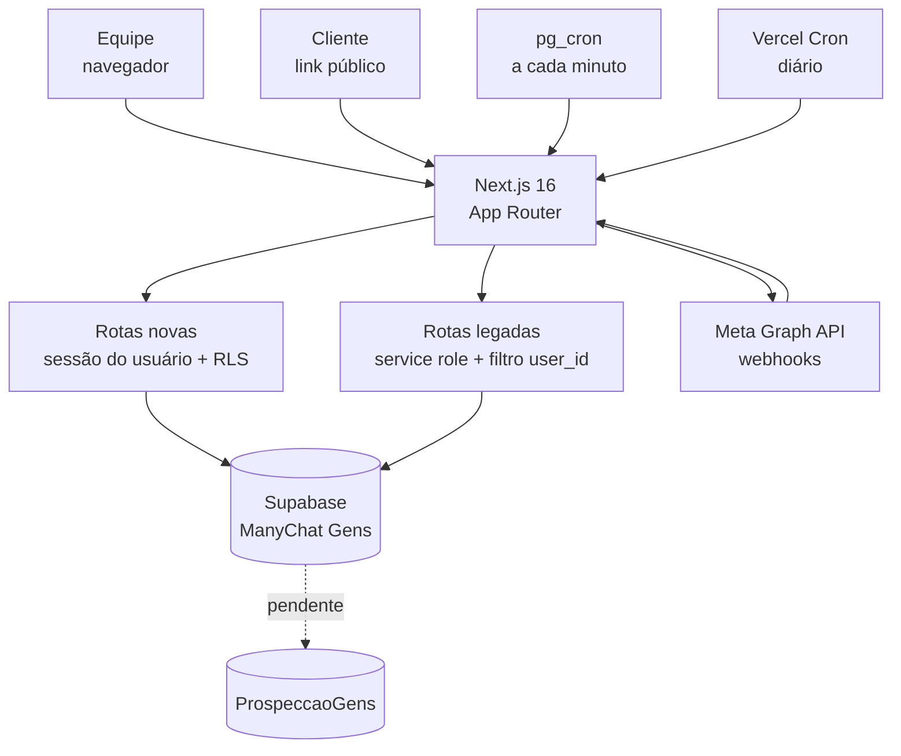
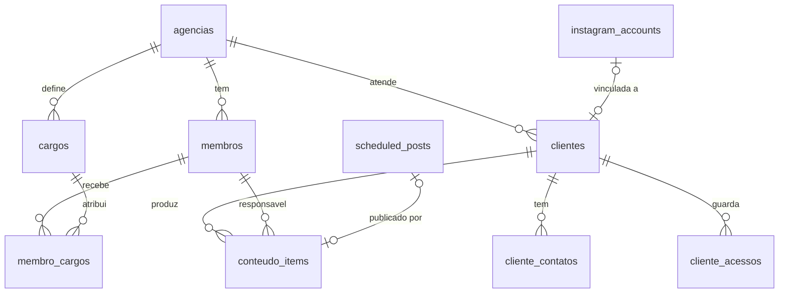
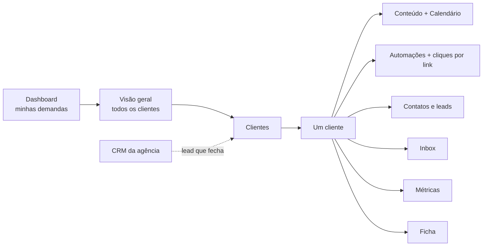
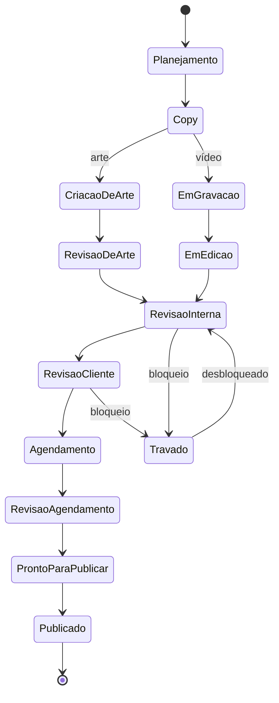

# GENSBot 2.0 — Projeto do sistema unificado da Agência GENS

> Versão 1 · 2026-09-20 · Documento vivo. Abra este arquivo numa sessão nova e siga daqui.
>
> Reúne o que estava espalhado em conversas. Não substitui `PLANO_REDESIGN_2.0.md` (Ondas de
> Publicações, Métricas e Dashboard, já implementadas) nem `ZERNFLOW-MELHORIAS.md` (editor visual
> de fluxo). Os dois continuam valendo como histórico.

---

## 0. Como usar este documento

**Para quem é.** Para o dono do projeto, para qualquer sessão do Claude Code e para qualquer
pessoa que entre nele. Tudo aqui foi verificado no código ou no banco em 2026-09-20, ou está
marcado como proposta.

**Legenda de status**

| Tag | Significa |
|---|---|
| `[FEITO]` | Existe, está em uma branch ou em produção, e foi verificado |
| `[EM ANDAMENTO]` | Começou, falta terminar ou validar |
| `[PLANEJADO]` | Desenhado, ainda sem código |
| `[DECIDIR]` | Depende de uma escolha do dono do projeto |

**Legenda de origem das decisões**

| Tag | Significa |
|---|---|
| **Decidido** | O dono do projeto disse explicitamente |
| **Proposto** | Sugestão do Claude, ainda sem confirmação. Trate como rascunho |

**Mapa de documentos**

| Arquivo | Situação |
|---|---|
| `PROJETO_GENSBOT_2.0.md` (este) | Fonte de verdade do projeto unificado: decisões, módulos, roadmap |
| `TELAS_GENSBOT_2.0.md` | Companheiro deste. Análise tela a tela a partir do Modo Criador, com a arquitetura por trás (tabelas, rotas, link público de aprovação) e as lacunas do modelo de dados |
| `PLANO_REDESIGN_2.0.md` | Histórico. Ondas de Publicações, Métricas e Dashboard. A Parte 1 (paleta) foi superada pela §8 |
| `ZERNFLOW-MELHORIAS.md` | Referência do editor visual de fluxo. A regra de não usar intermediários continua valendo (§1) |
| `DESIGN.md` (raiz) | **Desatualizado.** Descreve a direção de design anterior. Usar `design/design.md` |
| `design/design.md`, `design/design-tokens.json`, `design/design-a11y.md` | Design system atual, extraído de agenciagens.com.br |
| Spec no Claude Docs | https://claude.ai/code/artifact/d174084e-e4c3-43b0-bcbc-8fe89696fac9 — análise do Modo Criador e primeira especificação |

---

## 1. Visão e princípios

### Visão

Hoje a operação da agência está em três lugares que não se falam: o **GENSBot** (automação de DM
no Instagram, em produção), o antigo **plataforma-agencia** (CRM sem banco) e o projeto de
**Prospecção B2B**. O GENSBot 2.0 é um sistema só, no repositório do GENSBot, onde a agência
enxerga o cliente do início ao fim: da prospecção até a publicação do post, passando pela
automação que atende quem responde no Instagram dele.

### Princípios

| # | Princípio | Consequência prática |
|---|---|---|
| 1 | **O cliente é o contêiner de tudo** | Não se navega para "posts" e filtra por cliente. Entra-se no cliente e vê-se o mês dele |
| 2 | **Produção viva: só mudança aditiva** | O GENSBot recebe webhook todo minuto. Nada de alterar ou apagar tabela existente sem plano e rollback |
| 3 | **A segurança mora no banco** | RLS por agência. Rota nova usa a sessão do usuário, não a service role |
| 4 | **Falha fechada** | Sem membro ativo, a RLS nega tudo. Ter conta não é o mesmo que ter acesso |
| 5 | **Direto na Graph API da Meta, sem intermediários** | Não adotar Zernio/Late nem qualquer camada que passe token de cliente por terceiro |
| 6 | **Uma onda por vez, testada** | Mergear e verificar por completo antes de empilhar a próxima |
| 7 | **Verificar no navegador, não só compilar** | Build limpo não pega input verde nem dashboard que cai. Só a tela pega |
| 8 | **Referência, não cópia** | O Modo Criador ensina estrutura de informação. O visual é o da GENS |

---

## 2. Estado atual (2026-09-20)

### 2.1 Repositórios e branches

Pasta `C:\Users\Ewerton Monteiro\Documents\`

| Local | O que é | Situação |
|---|---|---|
| `GENSBot/` | **O projeto.** Next 16.3.0-canary, React 19, Tailwind v4, Supabase | Em produção (Vercel, `manychat-caseiro.vercel.app`) |
| `Projeto Agencia GENS/sistema-gens/` | Scaffold que criamos e depois abandonamos | **Abandonado.** O `design/` já foi copiado para o GENSBot (2026-09-20). Sobram as migrations 001–005, que valem só como histórico. Pode ser arquivado |
| `Projeto Agencia GENS/plataforma-agencia/` | CRM antigo, sem banco desde 2026-09-02 | Superado por este projeto |

Branches locais do GENSBot (nada foi enviado ao GitHub):

| Branch | Conteúdo | Situação |
|---|---|---|
| `main` | Produção. Último commit `a2189c4` (Etapa 5 do formulário guiado, PR #101) | Intocada |
| `db/sistema-multitenant` | 4 migrations do núcleo multi-tenant | Já aplicadas no banco de produção |
| `design/sistema-gens-tokens` | Design system aplicado (Sora, paleta, sombra dura, sem dark mode) | Base da branch abaixo |
| `feat/clientes` | Contém as duas acima, mais a tela de Clientes e a correção do Dashboard. HEAD `26b618d` | **Onde está tudo.** Falta validar com a conta real e abrir PR |

### 2.2 Bancos (Supabase, organização "Agência GENS", plano gratuito: 2 projetos ativos)

| Projeto | Ref | Papel hoje |
|---|---|---|
| **ManyChat Gens** | `ecahlegiaqikxnkdifhn` | **Banco único do sistema.** GENSBot + tabelas novas |
| ProspeccaoGens | `nbzaikqdnuhdzakghxnc` | Vestigial. Guarda as tabelas de prospecção (vazias) e recebeu por engano cópias das migrations novas. Ver §10.3 |

### 2.3 O que o GENSBot já é (verificado)

- 36 rotas de API legadas, mais 4 novas de clientes.
- Publicação e agendamento de posts, reels e stories (`scheduled_posts`, com `approval_status`).
- Editor visual de fluxo (`@xyflow/react`) e formulário guiado em timeline (Etapas 1–5 mergeadas).
- Automação por comentário, DM e resposta a story. Inbox. Métricas e insights. Links UTM.
- Aba CRM que já lê e escreve no banco ProspeccaoGens por uma segunda conexão (`PROSPECCAO_SUPABASE_*`).
- Login por e-mail e senha, e contas de Instagram por usuário via *Instagram API with Instagram Login*.

Números de produção em 2026-09-19: 435 contatos, ~13 mil eventos, 1.364 mensagens, 6 contas de
Instagram, 12 automações. Dois jobs `pg_cron` a cada minuto (`gensbot-drain-queue` e
`gensbot-publish-scheduled`) e dois crons da Vercel (`refresh-token` às 3h e `check-alerts` às 8h).

Tabelas vazias em produção: `sequences`, `followups`, `alert_notifications`.

### 2.4 Usuários no banco de produção

| E-mail | Situação |
|---|---|
| `ewertonphillipe18@gmail.com` | **Dono.** Master ativo da Agência GENS. Dono das 6 contas de Instagram e das 12 automações |
| `suporte.ewertondsgn@gmail.com` | Existe. **Sem acesso ao sistema novo** (sem linha em `membros`) `[DECIDIR]` |
| `ewertonphillipe18+gensbottest@gmail.com` | Idem `[DECIDIR]` |
| `marcolinoffls@gmail.com` | Nunca confirmou o e-mail. Sem acesso `[DECIDIR]` |
| `teste.sistemagens@example.com` | **Conta de teste criada em 2026-09-19.** Membro ativo. Remover ao fim dos testes (§15) |

---

## 3. Decisões

| # | Decisão | Origem | Motivo |
|---|---|---|---|
| D1 | Construir **dentro do repositório do GENSBot**, não num projeto novo | **Decidido** | O GENSBot já tem 36 rotas e parte do roadmap pronta. Falta a espinha de clientes, equipe e conteúdo |
| D2 | O banco único é o **ManyChat Gens** | **Decidido** | Centro de gravidade. Criar tabela nova ao lado é bem menos arriscado que mover 13 mil eventos e 2 crons |
| D3 | As 6 contas de Instagram do GENSBot **são clientes da agência** | **Decidido** | Cada `instagram_account` vira uma linha em `clientes` |
| D4 | A prospecção B2B **será absorvida** pelo sistema | **Decidido** | Os dados nascem no banco certo, sem sincronização |
| D5 | Uso **interno**, sem revenda. Sem planos nem cobrança no MVP | **Decidido** | Schema já é multi-tenant (`agencia_id`) para não fechar a porta |
| D6 | **Sem dark mode** por enquanto | **Decidido** | Tudo desenhado no claro. Toggle, script anti-flash e bloco `.dark` foram removidos |
| D7 | Design system vem de **agenciagens.com.br** | **Decidido** | Tokens extraídos do CSS real. Ver §8 |
| D8 | **Sequências**: apagar | **Decidido** | Nunca usada: 0 linhas em `sequences` e `followups` |
| D9 | **Contatos e leads** ficam dentro do cliente, alimentados pelas automações dele | **Decidido** | Um contato nasce quando a automação do cliente gera o lead |
| D10 | **CRM** é o da agência (quem ela quer vender), aba de primeiro nível. CRM por cliente fica para depois | **Decidido** | São públicos diferentes. Ver §6.2 |
| D11 | **Links UTM** ficam, mas como métrica da automação: quantos cliques teve cada link daquela automação | **Decidido** | O número pertence à automação, não a um catálogo de links |
| D12 | Rotas novas usam **sessão do usuário + RLS**, não service role | Proposto, aplicado | Uma rota que esqueça um filtro não vaza dado de outra agência |
| D13 | **Arquivar, não apagar** cliente | Proposto, aplicado | Nada se perde, dá para restaurar |
| D14 | Esteira de conteúdo de **13 estados** | Proposto | Baseada no Modo Criador. Confirmar |
| D15 | Navegação de primeiro nível reduzida a **6 itens** | Proposto | Ver §6. Confirmar |
| D16 | Logs de Eventos sai da navegação principal e vai para Configurações | Proposto | Ferramenta de depuração, não tela de trabalho |

---

## 4. Arquitetura

**Duas formas de acessar o banco convivem, de propósito.**

| | Rotas legadas | Rotas novas (`/api/clientes/**`) |
|---|---|---|
| Cliente Supabase | Service role (`src/lib/supabase.ts`) | Sessão do usuário (`src/lib/supabase-server.ts`) |
| Isolamento | Cada rota filtra `user_id` à mão | A RLS filtra por agência no banco |
| Risco | Esquecer um filtro vaza dado | Falha fechada |
| Meta | Migrar aos poucos, na medida em que forem tocadas | Padrão de tudo que for novo |

**Módulos de apoio novos:** `src/lib/clientes.ts` (tipos, validação por whitelist, paleta de avatar),
`src/lib/clientes-server.ts` (contexto de agência, tradução de erros do Postgres).

---

## 5. Modelo de dados

### 5.1 Tabelas novas `[FEITO]` (migrations `20260919_sistema_*.sql`)

| Tabela | Função | Pontos importantes |
|---|---|---|
| `agencias` | Tenant raiz | `slug` único. Hoje só existe `gens` |
| `membros` | Pessoa da equipe | 1:1 com `auth.users`. `papel` = `master` ou `membro`. `ativo` |
| `cargos` | Cargos configuráveis | `capacidades jsonb`: chaves livres, sem migration por permissão nova |
| `membro_cargos` | Uma pessoa, vários cargos | |
| `clientes` | Ficha completa | `instagram_account_id` único (uma conta, um cliente). `lead_id` guarda o ponteiro do CRM. `ativo` para arquivar |
| `cliente_contatos` | Contatos | `e_grupo_whatsapp`: mensagens de atualização vão ao grupo, não ao individual |
| `cliente_acessos` | Cofre de acessos | **Só master.** `senha_cifrada` (a aplicação cifra, o banco nunca vê o valor). Sem UI ainda |
| `conteudo_items` | Esteira de conteúdo | 13 status, `mes_referencia` sempre dia 1, `scheduled_post_id` liga ao agendamento do GENSBot. Sem UI ainda |

### 5.2 Segurança do banco

- Helpers `private.agencia_atual()` e `private.e_master()` no schema `private`. Em `public` o
  PostgREST os publicaria como RPC.
- Toda tabela nova: RLS ligada, policy por `agencia_id = private.agencia_atual()`.
- `cliente_acessos`: policy exige `private.e_master()`.
- Trigger `on_auth_user_created` cria o `membro` no cadastro. Como o dono já existe, **todo cadastro
  novo entra inativo** e depende de aprovação de um master. A função captura qualquer erro: nunca pode
  derrubar o signup de produção.
- RLS testada como usuário autenticado (papel `authenticated`): dono grava e lê; usuário sem `membros` vê 0 e é bloqueado.

### 5.3 Pendências do modelo

| Item | Situação |
|---|---|
| `instagram_accounts.user_id` é o dono, não a agência | **Bloqueia a entrada de mais membros.** Quem não é dono não enxerga as contas. Migrar para `agencia_id` (§7.6) |
| `messages`, `processed_webhook_events`, `followups`, `alert_notifications` com RLS ligada e sem policy | Aviso INFO dos advisors. Funciona porque a service role ignora RLS. Documentar ou criar policy |
| Tabelas de prospecção (`leads`, `lead_activities`, `lead_signals`, `scrape_runs`, `message_templates`) estão no ProspeccaoGens | Trazer para o ManyChat Gens quando a Onda 6 começar |
| `contacts.user_id`, `automations.user_id` etc. | Mapear para `agencia_id` na consolidação |

---

## 6. Navegação e telas

### 6.1 De 10 itens para 6

Hoje: Dashboard · Agendamentos · Métricas · Automações · Contatos/Leads · Inbox · Sequências · CRM · Links UTM · Logs.

| Item atual | Destino | Origem |
|---|---|---|
| Dashboard | Dashboard (minhas demandas e visão geral) | Proposto |
| — | **Clientes** (novo) `[FEITO]` | Decidido |
| Agendamentos | Conteúdo (geral) e aba de conteúdo dentro do cliente | Proposto |
| Métricas | Aba dentro do cliente, mais visão geral em Dashboard | Proposto |
| Automações | Aba dentro do cliente (escopada na conta dele) | Proposto |
| Contatos/Leads | **Aba dentro do cliente**, alimentada pelas automações | **Decidido** |
| Inbox | Aba dentro do cliente | Proposto |
| Sequências | **Apagar** | **Decidido** |
| CRM | **Primeiro nível**, é o CRM da agência | **Decidido** |
| Links UTM | **Dentro da automação**, como contagem de cliques por link | **Decidido** |
| Logs de Eventos | Configurações | Proposto |
| — | Equipe (novo) | Proposto |

**Primeiro nível resultante (proposto):** Dashboard · Clientes · Conteúdo · CRM · Equipe · Configurações.

O eixo vertical é o mergulho num cliente. O horizontal são as visões que cruzam todos (calendário
geral, dashboard, relatório de equipe). A seta pontilhada é a conversão de lead em cliente.

### 6.2 Dois CRMs que não se misturam

| | CRM da agência | Contatos do cliente |
|---|---|---|
| Quem são | Empresas que a GENS quer ter como cliente | Pessoas que responderam à automação de um cliente |
| Origem | Prospecção B2B (Apify, Google Maps) | Automação de DM ou comentário no Instagram do cliente |
| Tabela | `leads` | `contacts` |
| Onde mora | Aba de primeiro nível | Dentro do cliente |

Juntar os dois numa aba só misturaria públicos sem relação. Foi um erro de proposta, corrigido em 2026-09-18.

### 6.3 A ficha do cliente `[FEITO]`

Dossiê em uma tela longa, seções com título em caixa alta (eyebrow):

Cabeçalho (avatar, nome, nicho, arquivar) → **Trabalhar neste cliente** (atalhos) → Identificação →
Instagram → Contrato e fiscal → Operação → Briefing e notas → Contatos.

Os atalhos ("Automações", "Leads & Público", "Inbox", "Métricas", "Agendamentos") selecionam a conta
do Instagram do cliente e trocam de aba, reaproveitando as telas existentes.

### 6.4 O que se herda do Modo Criador (estrutura, não visual)

1. O cliente é o contêiner.
2. **O mês é a unidade de trabalho**, com "Duplicar mês".
3. O cliente tem abas próprias (dois níveis de navegação).
4. A ficha é um dossiê denso, não um formulário.
5. A home é pessoal ("Minhas demandas", com "Ver como" outra pessoa).
6. Configuração pesada mora longe da operação.

---

## 7. Módulos

### 7.1 Clientes `[FEITO]` no MVP

- **Entregue:** lista com busca e arquivados, criar, ficha completa, contatos com grupo de WhatsApp,
  arquivar e restaurar, atalhos para as abas existentes, "Criar clientes a partir das contas" (as 6).
- **Falta:** cofre de acessos (decidir a criptografia, §14), upload de contrato e pasta do Drive,
  etapa do ciclo como lista guiada com onboarding, recorrências de tarefas, métricas do cliente
  (itens totais, prontos, travados, lead time).
- **Aceite:** RLS impede ver cliente de outra agência; whitelist descarta `agencia_id` do corpo;
  fluxo criar, editar, contato e arquivar verificado no navegador. *Verificado com a conta de
  teste. Falta validar com a conta real (as 6 contas de Instagram).*

### 7.2 Conteúdo e esteira `[PLANEJADO]`

Tabela pronta (`conteudo_items`), sem tela.

- **Escopo:** grid do mês (posts numerados, miniatura, tipo, status, responsável, prazo), calendário
  mensal com miniatura no hover, quadro por status, "Duplicar mês", anexos, comentários de revisão.
- **Aprovação do cliente por link público, sem login:** preview de feed fiel ao Instagram, aprovar
  ou pedir ajuste com um toque. Resolve a aprovação perdida no WhatsApp.
- **Elo com o GENSBot:** a esteira decide *quando está pronto*. Ao chegar em "pronto para publicar",
  cria ou atualiza o `scheduled_posts` correspondente, e o cron `publish-scheduled` publica. Não
  reconstruir publicação.
- **Automações internas simples:** "quando o status virar X, mudar para Y ou atribuir a Z".
  Rodam no servidor. Diferentes das automações de DM (§7.3).
- **Aceite:** um item percorre a esteira até "publicado" sem sair do sistema; o link de aprovação
  funciona sem login e não expõe outros clientes; item com `scheduled_post_id` reflete o status real
  do agendamento.

### 7.3 Automações `[FEITO]` no núcleo, melhorias `[PLANEJADO]`

O motor de DM já existe e não será reconstruído.

- **Melhorias decididas:** cliques por link dentro de cada automação (D11); leads gerados alimentam
  a aba de contatos do cliente (D9).
- **Melhorias propostas:** card de automação com disparos, leads e cliques; simulador de conversa de
  DM (bolhas do bot e do lead); indicador de validade do token da conta.
- **Regra permanente de texto:** toda copy de DM e botão passa pelo humanizer antes de ser apresentada.
- **Aceite:** ao abrir uma automação, vê-se quantos cliques teve cada link, sem abrir outra aba.

### 7.4 Contatos e inbox por cliente `[PLANEJADO]`

- Aba Contatos e leads dentro do cliente, escopada pela conta de Instagram vinculada.
- Inbox como aba do cliente (proposto).
- **Aceite:** um contato gerado por automação do cliente A não aparece no cliente B.

### 7.5 CRM da agência e prospecção `[PLANEJADO]`

- **Hoje:** aba CRM já lê e escreve no ProspeccaoGens (`PROSPECCAO_SUPABASE_*`). Todas as tabelas
  estão vazias. A rota `POST /api/crm/leads/[id]/activities` **já estava quebrada antes**: insere
  `type: 'note'` mas o constraint da tabela só aceita `nota`, `mensagem_enviada`,
  `resposta_recebida`, `reuniao_agendada`, `erro_envio`.
- **Escopo:** trazer as 5 tabelas de prospecção para o ManyChat Gens; funil Novo → Qualificado →
  Contatado → Promovido; pipeline Apify (Google Maps) → qualificação → outreach; promover lead a
  cliente preenchendo `clientes.lead_id`, `responsavel_venda_id` e `convertido_em`.
- **Aceite:** um lead promovido cria o cliente com o que o CRM já sabia; a origem do cliente é rastreável.

### 7.6 Equipe e permissões `[PLANEJADO]`

- **Modelo (herdado do Modo Criador, proposto):** papel fixo (`master`, `membro`) mais cargos
  configuráveis com capacidades ligáveis; uma pessoa acumula cargos.
- **Cargos iniciais:** Designer, Editor, Redator(a), Social Media, Videomaker, Financeiro,
  Atendimento/Vendas.
- **Capacidades:** aprovar posts e reels · publicar no Instagram · ver relatório completo · configurar
  jornada do cliente · ver financeiro · gerenciar equipe · vendas/CRM · gerenciar automações · ver
  visão geral · excluir clientes · escolher editor e formato.
- **Metas mensais por pessoa:** posts, reels, dias de stories, gravações, outros, publicação
  responsável. Relatório de produtividade.
- **Fluxo de entrada:** cadastro cai como membro inativo; um master aprova e atribui cargos.
- **Pré-requisito:** mover a propriedade de `instagram_accounts` (e `automations`, `contacts`) de
  `user_id` para `agencia_id`. Sem isso, o segundo membro não enxerga nada.
- **Aceite:** um membro não-master aprovado vê os clientes e as contas de Instagram da agência e
  não vê `cliente_acessos`.

### 7.7 Financeiro `[PLANEJADO]`

Dados já na ficha (valor mensal, dia de vencimento, contrato). Falta: visão geral de pagamentos,
margem por cliente, contrato gerado para assinatura. Fica atrás da capacidade "ver financeiro".

### 7.8 Dashboard e relatórios `[PLANEJADO]`

- **Início pessoal** ("Minhas demandas", "Ver como"), depois visão geral: entregas do mês
  (ex.: 199 de 233), gargalos, prazo próximo.
- O Dashboard atual (KPIs de automação) continua, com a correção já feita (§12.4).

### 7.9 Configurações `[PLANEJADO]`

Equipe · Integrações (Instagram, Drive) · Automações internas · Clientes (visão geral, jornada,
margem, pagamentos) · Logs de Eventos · Base de conhecimento.

### 7.10 Notificações `[PLANEJADO]`

Comentário novo, prazo próximo, aprovação do cliente. Push no celular. A equipe usa o sistema no
celular, então mobile é requisito, não bônus.

### 7.11 Publicação no Instagram `[FEITO]`

Já implementada (`/api/instagram/publish`, cron `publish-scheduled`, `scheduled_posts`).
**Status do App Review da Meta: a confirmar `[DECIDIR]`.** Não assumir aprovado.

---

## 8. Design system

Fonte: agenciagens.com.br, valores lidos do CSS real (9 custom properties explícitas), não estimados.
Arquivos: `design/design.md` (completo), `design/design-tokens.json` (DTCG), `design/design-a11y.md`.

### 8.1 Tokens essenciais

| Uso | Token | Valor |
|---|---|---|
| Fundo | `paper` | `#f7f8f2` |
| Faixa suave | `hero-soft` | `#edf4d8` |
| Superfície escura | `deep` | `#162d16` |
| Texto | `ink` | `#192313` |
| Texto secundário | `muted` | `#59614f` (6.06:1 sobre paper) |
| Acento de marca | `lime` | `#d8ff3c` |
| Verde secundário | `brand` | `#bada55` |
| Bordas | `line` / `line-strong` / `line-deep` | `#d9dfce` / `#bac8a1` / `#657e48` |
| Fonte | Sora | 400, 500, 600, 700. Nunca acima de 700 |
| Sombras | duras, **sem blur** | `5px 5px`, `7px 8px`, `9px 9px` |
| Raios | pequenos | 3, 5, 8, 12, 20px, círculo |

Títulos com tracking negativo (-0.035em a -0.055em). Eyebrows em caixa alta com +0.15em.

### 8.2 Regras de marca (violar é bug)

- **A sombra dura sem blur é o gesto de marca.** Trocar por `shadow-md` descaracteriza o sistema.
- **Lima é ação e status**, nunca fundo de área grande de leitura.
- **Sobre lima, texto sempre ink** (14.16:1). Branco sobre lima dá 1.15:1. Lima como texto sobre claro dá 1.08:1.
- Nenhum segundo acento vibrante. Cor de cliente é dado, com paleta terrosa própria.
- Título alinhado à esquerda. Sem dark mode.

### 8.3 Armadilha conhecida

No GENSBot, **`--accent` significa "superfície sutil"** (fundo de input, hover), não a cor de marca.
Apontá-lo para o lima pintou todos os inputs de verde. O lima tem token próprio: `--lime`.

### 8.4 Estado da aplicação `[FEITO]` na branch `feat/clientes`

Sora, paleta, sombras duras, `eyebrow` como utility, card com borda + sombra dura, dark mode
removido. **Isto muda a aparência do app inteiro em produção quando for mergeado.** Revisar antes.

### 8.5 Biblioteca de componentes `[PLANEJADO]`

Evoluir `src/components/ui` (Button, Card, Badge, Input, Select, Textarea, Sheet, EmptyState), sem
duplicar. Catálogo em rota própria (`/design-system`), fora das telas atuais.

Componentes de domínio previstos: card de cliente, cabeçalho de cliente com abas, badge dos 13
status, card de post do mês, calendário mensal, preview de feed para aprovação, card de automação,
contador de cliques por link, etapa do fluxo, simulador de DM, indicador de token, card de lead,
coluna de funil, membro com cargos, matriz de permissões, meta mensal com progresso, card de
indicador com minigráfico, paleta de comandos, central de notificações, campo de acesso protegido.
Gerais: estado vazio, skeleton, erro de carregamento, banner de acesso pendente, confirmação
destrutiva.

Regras de construção: estados padrão, hover, foco, selecionado, desabilitado, carregamento e erro;
texto longo; tela de 375px; conteúdo em português e realista; tudo demonstrável com dados falsos.

### 8.6 Tensão a resolver: densidade

O site é arejado porque é institucional; um sistema com quadro e calendário é denso. Regra: a
densidade vem de **hierarquia tipográfica** (título pesado, corpo leve no mesmo tom), não de
espremer espaçamento.

---

## 9. Segurança e conformidade

### 9.1 O que já está aplicado `[FEITO]`

- RLS por agência nas tabelas novas, testada com o papel `authenticated`.
- Whitelist de campos: `agencia_id`, `id` e timestamps nunca entram pelo corpo da requisição.
- O `instagram_account_id` do corpo é validado contra as contas do próprio usuário (a FK ignora RLS).
- `access_token` do Instagram nunca vai ao navegador.
- Falha fechada: `validarContaInstagram` retorna `false` se não consegue confirmar posse.
- Erros do Postgres traduzidos, sem vazar detalhe interno.
- Advisors de segurança do banco: sem alertas nas tabelas novas.

### 9.2 Achados em aberto

| Achado | Gravidade | Situação |
|---|---|---|
| `claim_queue_jobs` executável por **qualquer pessoa sem login** via `/rest/v1/rpc/claim_queue_jobs` | Alta | **Já existia.** Não corrigido: é a função que o cron chama. Investigar como o app a usa antes de revogar |
| Proteção contra senha vazada desligada no Supabase Auth | Média | Ativar no painel |
| `criar_membro_no_signup` executável via RPC | Baixa | Corrigido (`revoke execute`) |
| RLS ligada sem policy em 4 tabelas legadas | Info | Ver §5.3 |
| Conta de teste ativa em produção | Média | Remover (§15) |

### 9.3 LGPD e cofre

Dados de cliente por agência isolados no banco. Cofre de acessos exige decidir a chave de
criptografia antes de haver interface (§14). Páginas de privacidade, termos e exclusão de dados já existem.

---

## 10. Migração e operação segura

### 10.1 Regras para mexer em produção

1. Só migration aditiva. Nada de `drop` ou `alter` em tabela existente sem plano.
2. Checar colisão de nomes antes de aplicar.
3. Testar RLS e triggers **como usuário autenticado**, dentro de bloco que desfaz tudo.
4. Trigger em `auth.users` nunca pode derrubar o cadastro: capturar erro.
5. Depois de aplicar: conferir que eventos continuam chegando e os 2 crons seguem ativos.
6. Toda migration aplicada via MCP também vira arquivo em `supabase/migrations/`.

### 10.2 Cuidados de `pg_cron`

Os dois jobs vivem **dentro do Postgres**, com URL de produção e `CRON_SECRET` no comando. Trocar de
banco não é trocar connection string: é recriar os jobs. Por isso a decisão D2 mantém o ManyChat Gens.

### 10.3 Limpeza do ProspeccaoGens `[DECIDIR]`

Contém cópias das migrations novas (`agencias`, `clientes`, `conteudo_items` etc.), um usuário de
teste (`teste@sistemagens.local`) e as tabelas de prospecção vazias. Decidir: (a) trazer as 5
tabelas de prospecção para o ManyChat Gens (Onda 6) e apagar o projeto; ou (b) manter só as 5 e
remover o resto. Como projeto pausado não ocupa slot ativo, não há pressa.

### 10.4 Riscos ao consolidar dados no futuro

Webhooks em trânsito (mitigado por `processed_webhook_events`, que já deduplica); tokens das contas
de Instagram precisam permanecer intactos ou as contas desconectam; janela em horário de baixo movimento.

---

## 11. Roadmap por ondas

Regra: **mergear e verificar por completo cada onda antes da próxima.**

| Onda | Entrega | Depende de | Status |
|---|---|---|---|
| 0 | Fundação: banco multi-tenant, semente, trigger de cadastro, design system aplicado | — | `[FEITO]` em `feat/clientes` |
| 1 | **Clientes** (lista, ficha, contatos, arquivar) | 0 | `[EM ANDAMENTO]`: falta validar com a conta real e abrir PR |
| 2 | **Equipe e acesso**: aprovar membros, cargos, contas de Instagram por agência | 1 | `[PLANEJADO]` |
| 3 | **Biblioteca de componentes** e catálogo `/design-system` | 0 | `[PLANEJADO]` |
| 4 | **Esteira de conteúdo**: quadro, calendário, duplicar mês, link de aprovação, elo com `scheduled_posts` | 2, 3 | `[PLANEJADO]` |
| 5 | **Automações e contatos por cliente**: cliques por link na automação, contatos e inbox dentro do cliente | 2 | `[PLANEJADO]` |
| 6 | **CRM da agência** consolidado no ManyChat Gens, promoção de lead a cliente | 2 | `[PLANEJADO]` |
| 7 | **Financeiro, Dashboard pessoal e visão geral, notificações** | 4, 5 | `[PLANEJADO]` |
| 8 | **Limpeza de navegação**: apagar Sequências, Logs para Configurações, 6 itens | 5, 6 | `[PLANEJADO]` |
| 9 | **Endurecimento**: `claim_queue_jobs`, policies das tabelas legadas, migrar rotas legadas para RLS, cofre de acessos, Drive | todas | `[PLANEJADO]` |

**Nota de ordem:** a Onda 2 vem cedo de propósito. Enquanto `instagram_accounts` pertencer a um usuário
e não à agência, nada do que vem depois funciona para o segundo membro da equipe.

---

## 12. Padrões de engenharia

### 12.1 Definição de pronto de uma onda

1. `npx tsc --noEmit` limpo.
2. ESLint sem **novos** erros nos arquivos tocados (§12.3).
3. `npx vitest run` passando. Lógica pura tem teste.
4. **Verificado no navegador**, logado, com dado real ou criado no fluxo: o caminho principal e um erro.
5. Se tocou o banco: migration em arquivo, RLS testada como `authenticated`, advisors rodados.
6. Em produção: eventos seguem chegando e os 2 crons seguem ativos.
7. Commit com mensagem que explica o *porquê*. PR pequeno.

### 12.2 Convenções

- Next 16 tem mudanças incompatíveis: ler o guia em `node_modules/next/dist/docs/` antes de escrever
  código (o `AGENTS.md` exige). Exemplos já encontrados: `middleware` virou `proxy`; `LayoutProps<"/">`.
- Migrations aditivas, datadas, em `supabase/migrations/`.
- Rota nova: `getContextoAgencia()`, sessão do usuário, whitelist de campos, `traduzirErroBanco`.
- Efeito de carga inicial: função de rede pura + `.then` dentro do efeito, `showToast` em ref
  (o do `page.tsx` é recriado a cada render e refaria o fetch).
- Reset de formulário em modal por `key`, não por efeito.
- Preferir edições de um arquivo por vez quando houver checagem prévia: edição em paralelo aplica
  só parte e deixa o código inconsistente.

### 12.3 Base de lint

O repositório já tem erros `react-hooks/set-state-in-effect` em componentes antigos (CRM, inbox,
contatos, painel de desempenho). **Não são novos.** A regra é não somar mais.

### 12.4 Correção já feita

`DashboardContentPanel` gravava a resposta da API sem olhar o status; um erro 500 ou 401 derrubava o
Dashboard inteiro. Corrigido no commit `cc10dbd`, **separado** para poder ser descartado.

### 12.5 Ambiente local

O `.env.local` só tem as variáveis `NEXT_PUBLIC_*`. Falta `SUPABASE_URL` e `SUPABASE_SERVICE_ROLE_KEY`,
então toda rota legada dá 500 localmente (cai em `placeholder.supabase.co`). Produção não é afetada.
Para desenvolver com o app completo, adicionar as duas (Project Settings → API). Nunca colar a
service role em conversa.

### 12.6 Regras de trabalho com o Claude

- Responder em português.
- Rodar o humanizer em todo texto de automação (DM e botões) antes de apresentar.
- Não usar jargão de marketing em conteúdo para clientes; falar de atendimento e qualificação de contatos.
- Verificar a interface no navegador antes de dizer que está pronta.
- Separar o que é fato verificado do que é suposição.

---

## 13. Riscos e dívidas técnicas

| Risco | Impacto | Mitigação |
|---|---|---|
| O merge de `feat/clientes` muda o visual do app inteiro em produção | Alto | Revisar em preview antes. Separar em dois PRs se preferir |
| Contas de Instagram pertencem a um usuário | Bloqueia equipe | Onda 2 |
| Rotas legadas com service role e filtro manual | Vazamento se esquecer um filtro | Migrar para sessão + RLS ao tocar em cada uma |
| `claim_queue_jobs` aberta a anônimos | Abuso da fila | §9.2 |
| Monólito `page.tsx` de ~1.400 linhas | Difícil de evoluir | Extrair por aba ao mexer em cada uma |
| Dois bancos ativos (ManyChat Gens e ProspeccaoGens) | Confusão e custo | §10.3 e Onda 6 |
| App Review da Meta não confirmado | Bloqueia publicação para clientes reais | Confirmar antes da Onda 4 |
| Sem push nem CI no que foi feito | Trabalho só na máquina local | Enviar as branches |

---

## 14. Decisões pendentes

- [ ] **Acesso dos 3 usuários** sem linha em `membros` (`suporte.ewertondsgn`, `+gensbottest`, `marcolinoffls`): aprovar, remover ou ignorar.
- [ ] **Confirmar a navegação de 6 itens** (D15) e o destino de Inbox e Métricas dentro do cliente.
- [ ] **Confirmar os 13 estados da esteira** (D14) ou ajustar.
- [ ] **Criptografia do cofre de acessos:** onde vive a chave (variável de ambiente, KMS, Vault do Supabase).
- [ ] **App Review da Meta:** aprovado para publicar em contas de clientes?
- [ ] **Destino do ProspeccaoGens** (§10.3).
- [ ] **Quem entra na equipe** e com quais cargos.
- [ ] **Catálogo `/design-system`:** público, protegido por login, ou só em desenvolvimento?
- [ ] **Merge:** um PR só ou dois (design separado do Clientes)?

---

## 15. Pendências operacionais imediatas

1. [ ] **Validar Clientes com a conta real:** banner "Criar clientes a partir das contas", seletor de vínculo e os atalhos. A conta de teste não é dona das contas de Instagram, então não cobriu isso.
2. [ ] **Remover a conta de teste** `teste.sistemagens@example.com` e o cliente "Clínica Vitta Odonto" (com o contato "Grupo Vitta") do banco de produção. A linha em `membros` sai em cascata.
3. [ ] **Remover `teste@sistemagens.local`** e as tabelas duplicadas do ProspeccaoGens (ou o projeto inteiro, conforme §10.3).
4. [ ] Adicionar `SUPABASE_URL` e `SUPABASE_SERVICE_ROLE_KEY` ao `.env.local`.
5. [ ] Ativar a proteção contra senha vazada no Supabase Auth.
6. [ ] Investigar e corrigir `claim_queue_jobs`.
7. [ ] Abrir PR de `feat/clientes` (e decidir se separa o design).
8. [ ] Arquivar a pasta `sistema-gens/` (o `design/` dela já foi copiado para o GENSBot e está fora do git ainda; entra no próximo commit).

---

## 16. Apêndices

### A. Arquivos criados

| Caminho | Função |
|---|---|
| `supabase/migrations/20260919_sistema_core_multitenant.sql` | Agências, membros, cargos, helpers de RLS |
| `supabase/migrations/20260919_sistema_clientes_conteudo.sql` | Clientes, contatos, acessos, esteira |
| `supabase/migrations/20260919_sistema_seed_agencia.sql` | Agência GENS, dono como master, trigger de cadastro |
| `supabase/migrations/20260919_sistema_revoga_execute_trigger.sql` | Fecha a função do trigger para RPC |
| `src/lib/clientes.ts` | Tipos, validação por whitelist, paleta e contraste de avatar |
| `src/lib/clientes.test.ts` | 23 testes |
| `src/lib/clientes-server.ts` | Contexto de agência, validação de posse, erros |
| `src/app/api/clientes/**` | 4 rotas: lista e criar, cliente, contatos, remover contato |
| `src/components/clientes-tab.tsx` | Lista, busca, criar |
| `src/components/cliente-ficha.tsx` | Ficha e contatos |
| `src/components/cliente-avatar.tsx` | Avatar com texto de contraste calculado |
| `src/app/globals.css` | Tokens da marca e utility `eyebrow` |

### B. Rotas de API novas

| Método e caminho | Função |
|---|---|
| `GET /api/clientes?arquivados=1` | Lista clientes e contas de Instagram do usuário |
| `POST /api/clientes` | Cria cliente |
| `GET` e `PATCH /api/clientes/[id]` | Lê e edita. Arquivar é `{ ativo: false }` |
| `POST /api/clientes/[id]/contatos` | Adiciona contato |
| `DELETE /api/clientes/[id]/contatos/[contatoId]` | Remove contato |

### C. Lições registradas

| Lição | Origem |
|---|---|
| Cadastro com e-mail já existente devolve sucesso sem criar conta nem trocar a senha (defesa contra enumeração de e-mails). Parece bug de login | Login que "não funcionava" |
| Criar usuário por SQL exige preencher `confirmation_token`, `recovery_token`, `email_change_token_new` e `email_change` com `''`. `NULL` quebra o login | Conta de teste |
| Trigger em `auth.users` roda no cadastro de produção: capturar erro | Trigger de signup |
| `--accent` é superfície, não marca | Inputs verdes |
| Limiar fixo de luminância erra em tons médios: comparar o contraste real dos candidatos | Avatar verde-oliva |
| Efeitos do React rodam duas vezes em desenvolvimento: função de carga com flag `ativo` | Fetch duplicado |
| O painel do navegador desenha com atraso: conferir o DOM antes de concluir que há bug | Ficha "presa" no esqueleto |
| Ler a rede antes da resposta chegar dá falso "não aconteceu". A primeira chamada de cada rota compila (~4s) | Contato "não criado" |
| O `lucide-react` novo não exporta ícones de marca | Ícone do Instagram |

### D. Referências externas

- **Modo Criador** (modocriador.com.br): estrutura de informação, ficha do cliente, esteira, permissões por cargo, planos por nº de clientes e colaboradores (só como referência, D5).
- **agenciagens.com.br**: fonte dos tokens de design.
- **ZernFlow**: só estudado. Não integrar (§1, princípio 5).
