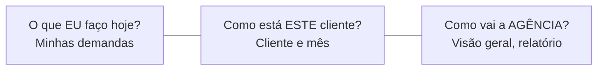
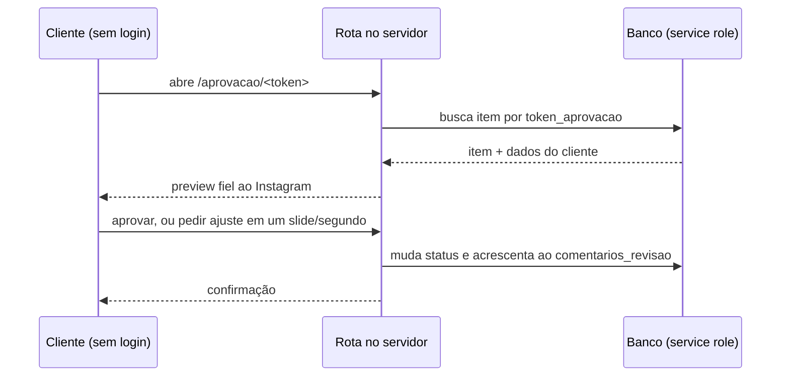
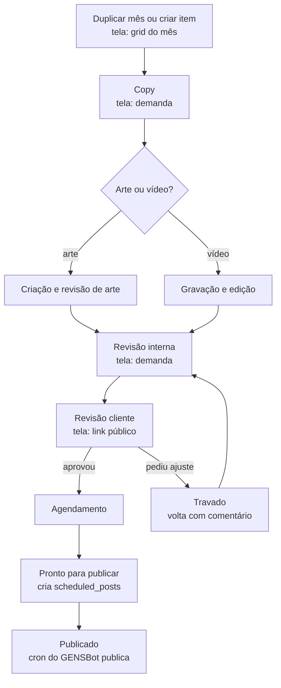

# Telas do GENSBot 2.0 — análise a partir do Modo Criador

> Versão 2 · 2026-09-21 · Companheiro do `PROJETO_GENSBOT_2.0.md`.
>
> Aquele documento responde **o que** construir e em que ordem. Este responde **como cada tela
> funciona** e **o que existe por trás dela**: tabelas, rotas, quem pode ver o quê e como uma tela
> conversa com a outra.
>
> **Mudança da v1 para a v2.** A v1 foi escrita a partir da análise do Modo Criador e marcava a
> esteira de conteúdo e o link de aprovação como lacunas. Entre a escrita e a revisão, os dois foram
> implementados (commit `63f5e3a`, mais o Design System SaaS em `e3f123f`, ambos já na `main`). As
> seções §3.5, §3.6, §4.1, §5 e §7 foram corrigidas contra o código real. O desenho que saiu difere
> do que este documento havia proposto — e em parte é melhor. As diferenças estão em §3.6.

---

## 0. Como ler este documento

A análise nasceu de uma exploração real do Modo Criador (modocriador.com.br), feita em 2026-09-18
dentro de uma conta de teste. Tudo que está marcado como observado foi visto na tela, não deduzido
da página de vendas.

| Marca | Significa |
|---|---|
| `[OBSERVADO]` | Visto na interface do Modo Criador durante a exploração |
| `[PROPOSTO]` | Desenho nosso para o GENSBot. Ainda não confirmado |
| `[EXISTE]` | Já implementado no GENSBot hoje |
| `[LACUNA]` | O Modo Criador resolve, e o nosso modelo de dados ainda não cobre |

**Aviso de método.** O Modo Criador é referência de **estrutura de informação**, nunca de visual. O
visual é o da GENS (`design/design.md`). E não copiamos o que não faz sentido para a agência: a §6
lista o que deixamos de fora de propósito.

---

## 1. Inventário do que foi observado

### 1.1 Navegação inferior, no celular `[OBSERVADO]`

Quatro ícones fixos: **Dashboard** · **Métricas** · **Clientes** · **Menu**. A decisão de colocar
Clientes na barra inferior, junto do Dashboard, diz o que o produto considera essencial no dia a dia.

### 1.2 O menu completo `[OBSERVADO]`

| Grupo | Itens |
|---|---|
| (sem grupo) | Biblioteca · Instagram · Vendas · Seleção de Fotos · Lixeira · Rotina |
| Visão geral | Visão Geral · Jornada do cliente · Pagamentos |
| Financeiro | Plano e Cobrança · Afiliados · Revenda |
| Equipe | Membros · Relatório |
| — | Ajuda |

### 1.3 Configurações, com navegação própria `[OBSERVADO]`

Equipe · Integrações · Automações · Clientes · Plano e Cobrança · Atualizações · Geral · Base de
conhecimento. Dentro de **Clientes**: Visão Geral · Jornada · Margem · Pagamentos.

Configuração pesada mora longe da operação. É um dos princípios que herdamos.

### 1.4 Os estados que o produto reconhece `[OBSERVADO]`

A lista completa do seletor de automação tem **15 estados**:

Planejamento · Copy · Criação de arte · Revisão de arte · Em gravação · Em edição · Revisão interna ·
Revisão cliente · Agendamento · Revisão agendamento · Pronto para publicar · Finalizado/Publicado ·
Travado · **Pendente** · **Concluído**

**Descoberta importante.** Os dois últimos não pertencem à esteira de conteúdo. São o par de estados
das tarefas de **Rotina** — trabalho do dia a dia que não é post. Isso explica por que nossa esteira
tem 13 estados e não 15: separamos as duas coisas sem perceber que o Modo Criador também separa.
Ver §5.3.

---

## 2. Os três eixos de navegação

O Modo Criador organiza tudo em três perguntas diferentes, e cada uma tem sua própria tela inicial.

| Eixo | Pergunta | Tela inicial | Quem usa mais |
|---|---|---|---|
| Pessoal | O que eu faço hoje | Minhas demandas | Designer, editor, redator |
| Cliente | Como está este cliente | Cliente → mês → abas | Social media, atendimento |
| Agência | Como vai a operação | Visão geral, calendário geral, relatório | Dono, gestor |

Confundir os três é o erro clássico. Um dashboard que abre em "como vai a agência" não serve a quem
precisa saber o que editar hoje. Por isso a home é pessoal, e a visão da agência é outra tela.

---

## 3. As telas, uma a uma

### 3.1 Home — Minhas demandas

**No Modo Criador** `[OBSERVADO]`

Abre com saudação e uma frase do dia. Em seguida: "Minhas demandas", contador de demandas
atribuídas, botão "Nova demanda" e um seletor **"Ver como:"** que permite olhar a fila de outra
pessoa. Duas visões: **Lista** e **Minha Semana**. Estado vazio: "Tudo em dia — nenhuma demanda
aberta pra você."

Abaixo, um bloco **"Como estou indo?"** com o mês corrente, quantas demandas foram finalizadas,
barras por semana (S1 a S4), média semanal e link para histórico de 6 meses.

**No GENSBot 2.0** `[PROPOSTO]`

Mesma estrutura, com um acréscimo que faz sentido no nosso caso: além das demandas de conteúdo, a
home mostra o que exige atenção nas automações (token de Instagram vencendo, automação com falha de
envio). Hoje o Dashboard do GENSBot abre em indicadores de automação `[EXISTE]`, que passam a ser um
bloco da visão da agência, não a primeira coisa que a pessoa vê.

**Por trás**

| Elemento | Origem |
|---|---|
| Lista de demandas | `conteudo_items` filtrado por `responsavel_id = auth.uid()` ou `editor_id` |
| "Ver como" | Troca o filtro para outro `membros.id`. Exige capacidade "ver relatório completo" |
| "Como estou indo?" | Contagem de itens que chegaram a `publicado` no mês, agrupada por semana |
| Minha Semana | Mesmos itens, agrupados por `data_programada` ou prazo |

`[LACUNA]` O item de conteúdo **não tem campo de prazo interno**, só `data_programada` (quando
publica). O Modo Criador avisa "Reel 'Bastidores' vence amanhã", o que é prazo de entrega, não data
de publicação. São coisas diferentes: a arte precisa ficar pronta antes do dia da publicação.

### 3.2 Clientes — a lista

**No Modo Criador** `[OBSERVADO]`

Busca no topo, contador, botão "+". Clientes agrupados por **vertical** (vimos "SOCIAL MEDIA 1").
Cada cartão: círculo colorido com a inicial e o nome. Estado vazio com "Criar o primeiro cliente".

Criar cliente é um modal mínimo: **só nome e cor**. Tudo o mais se preenche depois, na ficha.

**No GENSBot 2.0** `[EXISTE]`

Implementado, com diferenças deliberadas: cartão mais informativo (avatar, nome, nicho, @ do
Instagram, combinado de posts e reels por mês), busca que ignora acento e caixa, filtro de
arquivados, e um banner que oferece **criar clientes a partir das contas de Instagram já conectadas**
— atalho que só existe porque o GENSBot já tinha as contas.

O modal de criação ganhou nicho e vínculo com a conta do Instagram, mas seguiu a lição do Modo
Criador: poucos campos, o resto na ficha.

**Por trás**

`GET /api/clientes?arquivados=1` devolve os clientes da agência (a RLS filtra) e as contas de
Instagram do usuário. O agrupamento por vertical `[LACUNA]`: não temos campo de vertical; hoje
usamos `nicho`, que é texto livre e não agrupa.

### 3.3 Cliente — a casca com abas

**No Modo Criador** `[OBSERVADO]`

O cabeçalho do cliente carrega: avatar, nome, ícone de informação, **seletor de mês** (`< SETEMBRO
2026 >`) e o botão **"Duplicar mês"**. Abaixo, as abas: **Posts · Reels · Stories · Mais · Preview de
Feed · Ficha do Cliente**.

Esta é a decisão estrutural mais importante do produto inteiro: **o mês vive no cabeçalho do
cliente**, não dentro de cada aba. Trocar de mês mantém a aba; trocar de aba mantém o mês.

**No GENSBot 2.0** `[PROPOSTO]`

Mesma casca, com as abas ajustadas ao nosso escopo:

| Aba | Conteúdo | Situação |
|---|---|---|
| Conteúdo | Grid do mês, por tipo | `[PROPOSTO]` |
| Calendário | O mês em calendário | `[PROPOSTO]` |
| Automações | As automações da conta de Instagram do cliente | `[EXISTE]`, falta escopar |
| Contatos e leads | Quem respondeu às automações dele | `[EXISTE]`, falta escopar |
| Inbox | Conversas da conta dele | `[EXISTE]`, falta escopar |
| Métricas | Desempenho da conta dele | `[EXISTE]`, falta escopar |
| Ficha | O dossiê | `[EXISTE]` |

Hoje a ficha tem atalhos que selecionam a conta e trocam de aba no app inteiro `[EXISTE]`. É uma
ponte provisória: o destino é a aba viver dentro do cliente, sem trocar o contexto global.

**Por trás**

O mês é estado da tela (`mes_referencia`), propagado a todas as abas que dependem dele. Nas tabelas,
`conteudo_items.mes_referencia` é sempre **o dia 1** do mês — é um mês, não uma data.

### 3.4 O grid do mês — Posts, Reels, Stories

**No Modo Criador** `[OBSERVADO]`

Cada aba de tipo mostra os itens **numerados** (01, 02, 03…), com nome ("Post 1") e status
("PLANEJAMENTO"). Há dois modos de ordenação: **Personalizada** (arrasta para reordenar) e
**Cronológica**. Duas visualizações: lista e grade. Na grade, cada cartão tem miniatura, o número no
canto e ações de duplicar e excluir. Ao final, "Adicionar Posts".

Ao criar um cliente, o sistema já semeia 6 posts vazios em Planejamento — o mês nasce com estrutura,
não em branco.

**No GENSBot 2.0** `[PROPOSTO]`

Igual na estrutura. O número sequencial casa com o **badge circular numerado**, que é o elemento mais
repetido da identidade da GENS — a peça visual e a necessidade funcional se encontram sem esforço.

**Por trás**

| Elemento | Origem |
|---|---|
| Número | Posição derivada de `conteudo_items.ordem` dentro do mês e tipo |
| Ordem personalizada | `ordem` (smallint). Arrastar reescreve a sequência |
| Ordem cronológica | Ordena por `data_programada` |
| Miniatura | Primeiro item de `arquivos jsonb` |
| Duplicar mês | Copia os itens do mês anterior com status reiniciado e sem arquivos |

### 3.5 A demanda — o item de conteúdo

**No Modo Criador** `[OBSERVADO]` em parte — não abrimos um item preenchido

Pela estrutura das metas e das automações, um item carrega: tipo, status, responsável, editor,
arquivos, legenda, data programada e comentários. As metas da equipe distinguem explicitamente
**"Publicação resp."** — quem cuida do planejamento e da entrega do feed — de quem apenas editou.

**No GENSBot 2.0** `[PROPOSTO]`

A demanda é a unidade de trabalho. A tela precisa responder, sem rolagem: de quem é, em que pé está,
o que falta e qual o prazo.

Blocos previstos: cabeçalho (cliente, tipo, número, status), mídia e anexos, copy e legenda,
responsáveis, datas (prazo interno e publicação), histórico de comentários e a barra de ação que
move o status adiante.

**Por trás**

`[EXISTE]` **Comentários foram implementados**, mas não como tabela: são um `jsonb` na própria linha
do item (`conteudo_items.comentarios_revisao`). Cada comentário tem autor, tipo (`cliente` ou
`equipe`), texto, data, se está resolvido — e dois campos que a proposta original não previa e que
são melhores do que ela:

| Campo | Para quê |
|---|---|
| `slide_index` | Comentar **um slide específico** de um carrossel |
| `timestamp_seconds` | Comentar **um momento específico** de um vídeo ou reel |

Isso muda a conversa de revisão. Em vez de "o terceiro card está com o texto errado", o comentário
fica preso ao slide 3. Em vez de "tem um corte estranho lá pelos 30 segundos", fica em 00:27.

**Ressalva do formato.** `jsonb` é simples e rápido de construir, mas tem um custo: não dá para
consultar comentários entre itens sem varrer o campo. Um relatório do tipo "quantos ajustes o cliente
X pediu no mês" fica caro. Enquanto o volume for pequeno, funciona. Se virar relatório, vira tabela.

`[LACUNA]` **Não existe prazo interno**, como dito em §3.1. Continua em aberto.

### 3.6 Preview de Feed e o link de aprovação

Esta é a tela que mais justifica o produto, e a mais delicada de construir.

**No Modo Criador** `[OBSERVADO]`

Dentro do cliente, a aba **Preview de Feed** mostra "PREVIEW DE FEED · N PUBLICAÇÕES" com dois
controles: **"Ativar esse mês no link"** e **"Compartilhar preview"**, além da mesma escolha entre
ordem personalizada e cronológica.

Ou seja: o link é **por cliente e por mês**, e precisa ser **ativado explicitamente**. O cliente vê
o feed como ficará no Instagram — imagem e legenda — e aprova ou pede ajuste **sem criar conta**.

**No GENSBot 2.0** `[EXISTE]` — implementado em 2026-09-20

O que existe hoje, lido do código (`src/app/aprovacao/[token]/page.tsx`,
`src/app/api/aprovacao/[token]/route.ts`, migration `20260920_conteudo_aprovacao.sql`):

| Decisão | Como ficou | O que este documento propunha |
|---|---|---|
| Unidade do link | **Um token por item de conteúdo** (`conteudo_items.token_aprovacao`, uuid único) | Um token por cliente e mês |
| Onde mora | Coluna na própria tabela, gerada por padrão ao criar o item | Tabela `aprovacao_links` |
| Ativação | Não tem: o token existe desde que o item nasce | Ativar o mês explicitamente |
| Expiração e revogação | Não tem | Revogável, com validade |
| Comentários | `jsonb` no item, com slide e timecode | Tabela própria |
| Compartilhamento | **Link pronto para WhatsApp**, com mensagem formatada | "Compartilhar preview" genérico |
| Acesso ao banco | Service role no servidor, token na URL | Igual |
| Efeito de aprovar | Vai para `agendamento` | Igual |
| Efeito de pedir ajuste | Vai para `travado` e grava o comentário | Igual |

**Duas escolhas que ficaram melhores que a proposta.** O comentário preso a um slide ou a um segundo
do vídeo (§3.5) resolve um problema real de revisão. E o `gerarLinkWhatsAppAprovacao` reconhece como
a conversa com o cliente acontece de fato no Brasil: o link sai pronto, com texto, direto no WhatsApp
do contato — em vez de um botão de copiar que ninguém usa.

**Por trás — como a segurança funciona**

Nossa RLS se apoia em `private.agencia_atual()`, que devolve nulo para quem não está logado. A
política que protege todo o resto **não serve** para o link público. A implementação contorna isso do
jeito certo: a rota roda no servidor com service role, recebe o token pela URL, e devolve apenas
aquele item. O navegador nunca consulta o banco.

O token é `gen_random_uuid()`: aleatório e com entropia suficiente para não ser adivinhado. Correto.

**Quatro pontos foram encontrados ao ler o código. Dois já estão corrigidos.**

`[EXISTE]` **1. O link só abre a partir da revisão do cliente.** Antes disso a rota responde 404 com
uma explicação de que a publicação ainda está em produção. O token nasce junto com o item e nunca
muda, então sem essa checagem um link enviado uma vez deixava o cliente acompanhar arte pela metade e
cada revisão interna. A regra vive em `clientePodeVer()`, no módulo de domínio, e é testada.

`[EXISTE]` **2. Aprovar e pedir ajuste só valem quando é a vez do cliente.** A rota recusa com 409
qualquer ação sobre item fora de `revisao_cliente`. Isso fecha dois casos: um item em planejamento
saltar direto para agendamento, e o duplo clique em "aprovar" reprocessar o que já aconteceu.
Regra em `clientePodeAgir()`.

As mensagens de recusa são escritas para o cliente e **não expõem o estágio interno** — ele lê "ainda
está em produção", não "revisão de arte". Há teste garantindo isso.

`[LACUNA]` **3. O link nunca expira nem pode ser revogado.** Uma vez enviado, vale para sempre. Se um
contato sair da empresa do cliente, o link continua valendo na mão dessa pessoa. É decisão de
produto: validade por tempo, por mês, ou revogação manual.

`[LACUNA]` **4. O nome do autor vem do corpo da requisição**, sem validação. O comentário pode ser
assinado com qualquer nome. Baixo impacto, já que só quem tem o link chega lá.

### 3.7 A ficha do cliente

**No Modo Criador** `[OBSERVADO]`

Uma tela longa e densa, com seções em caixa alta:

Instagram (conectar, ou **gerar link para o próprio cliente conectar**, evitando pedir senha e 2FA) ·
Pasta de entregas no Drive · Métricas (itens totais, prontos, travados, lead time médio) · Etapa do
projeto · Sobre e configuração (foto, nicho, dia de revisão, posts e reels por mês, responsável fixo,
CNPJ ou CPF, responsável legal, CPF, endereço, valor mensal, dia de vencimento, observações,
concorrentes, briefing, roteiros recentes) · Contrato (anexar ou gerar para assinatura) · Arquivos da
marca · Links importantes · Contatos, com grupo de WhatsApp · Senhas e acessos, só para admin ·
Stories (notificar em Minhas Demandas) · Onboarding do cliente · Recorrências.

**No GENSBot 2.0** `[EXISTE]` em boa parte

Implementado: identificação, Instagram, contrato e fiscal, operação, briefing e notas, contatos com
grupo de WhatsApp. Falta: cofre de acessos (depende de decidir a criptografia), upload de contrato,
pasta do Drive, onboarding, recorrências e o bloco de métricas do cliente.

**A ideia mais inteligente que vimos:** o link para o cliente conectar o próprio Instagram. A agência
nunca toca na senha nem no 2FA dele. Vale copiar.

### 3.8 Calendário geral

**No Modo Criador** `[OBSERVADO]` na página de vendas, não na interface

"Todos os clientes, num calendário só", com miniatura ao passar o mouse.

**No GENSBot 2.0** `[PROPOSTO]`

Eixo da agência: o mês inteiro, de todos os clientes, com filtro por cliente e responsável. Serve
para enxergar choque de prazos — três gravações no mesmo dia, por exemplo.

**Por trás:** `conteudo_items` de todos os clientes da agência no mês, agrupado por dia. A cor de cada
item é a cor do cliente, que é justamente para isso que a paleta terrosa existe.

### 3.9 Equipe e relatório

**No Modo Criador** `[OBSERVADO]`

Três abas: Equipe · Relatório · Auditoria de produção.

Em Equipe: lista de membros com o papel ("ADM MASTER"), aviso de que novos cadastros ficam pendentes
até aprovação de um master, e uma matriz **"Diferença entre funções"** comparando Membro, Adm Setor e
Master por capacidade. Abaixo, **Cargos**: Adm Master, Atendimento/Vendas, Designer, Editor,
Financeiro, Redator(a), Social Media, Videomaker — cada um com seu conjunto de capacidades, e a nota
de que **cada pessoa pode ter mais de um cargo**.

Em **Metas da equipe**: por mês, por pessoa, quantos posts, reels, dias de stories, gravações, outros
conteúdos e publicações sob responsabilidade. Com uma observação reveladora: *"Rotina não tem meta —
só mostra quantas tarefas do dia a dia a pessoa já concluiu."*

**No GENSBot 2.0** `[PROPOSTO]`

Adotamos o modelo quase inteiro: papel fixo mais cargos configuráveis, várias funções por pessoa,
aprovação de novos membros. As tabelas `cargos` e `membro_cargos` já existem `[EXISTE]`, com
`capacidades jsonb` para não exigir migration a cada permissão nova.

`[LACUNA]` **Metas por membro e por mês não têm tabela.** Proposta: `membro_metas` (membro, mês,
posts, reels, stories, gravações, outros, publicação responsável).

### 3.10 Configurações

**No Modo Criador** `[OBSERVADO]`

Destaque para **Integrações**: a conexão do Google Drive é um assistente de três passos (conectar
conta, escolher pasta raiz, vincular clientes), com um botão de **"Reorganizar arquivos existentes"**
que move o que já foi anexado para a estrutura por cliente e mês. Cada agência conecta a própria
conta — os arquivos ficam com ela, não com a plataforma.

Em **Automações**: regras simples no formato *"Quando o status virar X → Alterar status para Y"* ou
*"→ Atribuir para Z"*, com a garantia de que rodam no servidor mesmo com a tela fechada. E dois
botões de disparo manual: "Rodar alertas de prazo" e "Rodar resumo diário".

**No GENSBot 2.0** `[PROPOSTO]`

Mesmo desenho. Vale notar a distinção que o GENSBot precisa deixar explícita na interface, porque
tem os dois tipos:

| Tipo | Exemplo | Onde roda |
|---|---|---|
| Automação de fluxo interno | Status virou "revisão cliente" → notificar responsável | Motor simples, no servidor |
| Automação de conversa | Comentário com palavra-chave → enviar DM | Motor que já existe `[EXISTE]` |

São coisas diferentes com o mesmo nome. Chamar as duas de "automação" na mesma tela confunde.

### 3.11 Financeiro

**No Modo Criador** `[OBSERVADO]`

Plano e Cobrança (Solo, Pro, Agência, Enterprise, por número de clientes ativos e colaboradores),
Afiliados, Revenda. Em Configurações → Clientes: Margem e Pagamentos.

**No GENSBot 2.0** `[PROPOSTO]`, com corte

Planos, afiliados e revenda **não se aplicam**: o sistema é de uso interno (decisão D5 do projeto).
O que interessa é o inverso — não quanto a agência paga pela ferramenta, mas **quanto cada cliente
paga e qual a margem**. Os dados já estão na ficha (valor mensal, dia de vencimento, contrato); falta
a visão consolidada.

### 3.12 As telas menores

| Tela do Modo Criador | O que é | Decisão |
|---|---|---|
| Biblioteca | Referências e inspiração | `[PROPOSTO]` manter, como biblioteca de referências por cliente |
| Seleção de Fotos | Fluxo onde o cliente escolhe fotos de um ensaio | `[PROPOSTO]` avaliar. Útil para quem faz ensaio, talvez não para toda agência |
| Rotina | Tarefas recorrentes do dia a dia | `[PROPOSTO]` necessário. Ver §5.3 |
| Lixeira | Itens excluídos, recuperáveis | `[PROPOSTO]` necessário para conteúdo |
| Vendas | CRM do Modo Criador | Já temos o nosso, separado |
| Instagram | Conexão das contas | `[EXISTE]` |
| Base de conhecimento, Ajuda, Atualizações | Documentação e changelog | Baixa prioridade |

---

## 4. A arquitetura por trás das telas

### 4.1 Mapa: tela → tabela → rota

| Tela | Tabelas | Rotas | Situação |
|---|---|---|---|
| Minhas demandas | `conteudo_items`, `membros` | `GET /api/demandas` | `[LACUNA]` |
| Clientes (lista) | `clientes`, `instagram_accounts` | `GET/POST /api/clientes` | `[EXISTE]` |
| Ficha do cliente | `clientes`, `cliente_contatos`, `cliente_acessos` | `GET/PATCH /api/clientes/[id]` | `[EXISTE]` |
| Esteira do cliente | `conteudo_items` | `GET/POST /api/conteudo` | `[EXISTE]` (`esteira-tab.tsx`) |
| Demanda | `conteudo_items` (comentários em `jsonb`) | `PATCH /api/conteudo/[id]` | `[EXISTE]` |
| **Aprovação pública** | `conteudo_items.token_aprovacao` | `GET/POST /api/aprovacao/[token]` e página `/aprovacao/[token]` | `[EXISTE]` |
| Calendário geral | `conteudo_items`, `clientes` | `GET /api/calendario?mes=` | `[LACUNA]` |
| Equipe | `membros`, `cargos`, `membro_cargos`, metas | `GET/PATCH /api/equipe` | Parcial |
| Automações | `automations`, `utm_links` | rotas atuais | `[EXISTE]` |
| Contatos e inbox | `contacts`, `messages` | rotas atuais | `[EXISTE]` |
| CRM da agência | `leads` e afins | `/api/crm/leads` | `[EXISTE]`, noutro banco |

### 4.2 O ciclo de vida de uma demanda

O caminho completo, do planejamento à publicação, e onde cada tela entra:

O ponto de virada está em **"pronto para publicar"**: é onde o sistema novo entrega o bastão para o
motor que já existe. A esteira decide *quando* está pronto; o GENSBot decide *como* publicar.

### 4.3 O elo com a publicação

`conteudo_items.scheduled_post_id` aponta para `scheduled_posts`, a tabela que o GENSBot já usa
`[EXISTE]`. O fluxo:

1. O item chega a `pronto_publicar` com `data_programada` preenchida.
2. O sistema cria ou atualiza a linha em `scheduled_posts`, com a conta de Instagram do cliente.
3. O job `gensbot-publish-scheduled`, que roda **a cada minuto dentro do Postgres**, chama a rota de
   publicação.
4. A publicação grava `ig_media_id` e `published_at`.
5. O item de conteúdo reflete: status `publicado`, `publicado_em` preenchido.

**Não reconstruir publicação.** Ela funciona, tem token das 6 contas e cron ativo. O trabalho é de
ligação, não de reimplementação.

**Risco a tratar:** o passo 5 precisa acontecer de fato. Se a publicação falhar, o item não pode
ficar preso em "pronto para publicar" sem ninguém saber. Proposta: quando `scheduled_posts.status`
virar erro, o item volta para `travado` com o motivo.

### 4.4 Automações internas

Motor simples, no servidor: *quando o status de um item virar X, faça Y*. As ações mínimas são mudar
status, atribuir responsável e notificar.

Duas rotinas diárias, espelhando o Modo Criador: **alerta de prazo** (itens que vencem amanhã e ainda
não estão prontos) e **resumo diário** (o que cada um tem para hoje). A infraestrutura já existe —
o cron da Vercel `check-alerts` roda às 8h `[EXISTE]`.

### 4.5 Notificações

| Evento | Quem recebe |
|---|---|
| Comentário novo em um item | Responsável e editor |
| Cliente aprovou ou pediu ajuste | Responsável e atendimento |
| Prazo amanhã | Responsável |
| Token do Instagram vencendo | Master |
| Falha ao publicar | Responsável e master |

A equipe trabalha no celular, então push não é enfeite. `[LACUNA]` — não existe tabela de
notificações; `alert_notifications` existe mas está vazia e serve a outro propósito.

### 4.6 Arquivos e Drive

O modelo do Modo Criador é bom e vale copiar: **cada agência conecta a própria conta do Google
Drive**, os arquivos ficam lá, organizados por cliente e mês, e o sistema guarda só o ponteiro.
Menos custo de storage e mais confiança — o cliente sabe onde está o material dele.

Hoje `conteudo_items.arquivos` é um `jsonb` com ponteiros. Falta o OAuth do Drive e a rotina que cria
as pastas.

### 4.7 Quem enxerga o quê

| Perfil | Vê |
|---|---|
| Master | Tudo, incluindo cofre de acessos e financeiro |
| Membro com cargo | Conforme as capacidades do cargo |
| Membro sem aprovação | Nada. A RLS nega (falha fechada) |
| Cliente, pelo link | Só o preview do mês ativado, do próprio cliente |

O último caso é o que sai da RLS e exige rota dedicada (§3.6).

---

## 5. Lacunas do nosso modelo de dados

Consolidado do que apareceu acima. Cada linha é uma decisão a tomar antes de construir a tela
correspondente.

| # | Lacuna | Tela afetada | Proposta |
|---|---|---|---|
| ~~L1~~ | ~~Comentários em um item~~ | — | **Resolvido** como `comentarios_revisao jsonb`, com slide e timecode (§3.5). Vira tabela se virar relatório |
| ~~L2~~ | ~~Link de aprovação~~ | — | **Resolvido** como `token_aprovacao` por item (§3.6). Faltam expiração, revogação e checagem de status |
| L3 | Prazo interno, separado da data de publicação | Demandas, alertas | Coluna `prazo` em `conteudo_items` |
| L4 | Metas por membro e mês | Relatório de equipe | `membro_metas` |
| L5 | Tarefas de rotina | Rotina, Minhas demandas | Ver §5.3 |
| L6 | Recorrências que geram tarefas | Ficha do cliente | `cliente_recorrencias` |
| L7 | Etapas de onboarding por cliente | Ficha, Jornada | `cliente_onboarding_etapas` |
| L8 | Jornada configurável | Configurações → Jornada | Hoje `clientes.etapa` é texto livre |
| L9 | Notificações | Todas | `notificacoes` |
| L10 | Lixeira para conteúdo | Lixeira | `excluido_em` em `conteudo_items` |
| L11 | Vertical do cliente | Lista de clientes | Campo próprio, hoje usamos `nicho` |
| L12 | Biblioteca de referências | Biblioteca | `cliente_referencias` |

### 5.3 A questão da Rotina

O Modo Criador trata dois mundos com telas diferentes:

| | Conteúdo | Rotina |
|---|---|---|
| O que é | Post, reel, story de um cliente | Tarefa do dia a dia |
| Estados | Os 13 da esteira | Pendente e Concluído |
| Pertence a | Cliente e mês | Pessoa, e às vezes cliente |
| Tem meta | Sim | Não, só contagem |

Nosso `conteudo_items.tipo` tem `avulso`, que parece cobrir — mas não cobre, porque um avulso ainda
percorre os 13 estados e pertence a um mês. Uma tarefa de rotina não tem "revisão do cliente".

Duas saídas possíveis: uma tabela `tarefas` separada, ou um campo que marque o item como rotina e
restrinja os estados válidos. **A primeira é mais honesta**: são entidades diferentes, com ciclos
diferentes. Fica como pergunta aberta (§8).

---

## 6. O que decidimos não copiar

| Do Modo Criador | Por quê |
|---|---|
| Planos, Afiliados, Revenda | Uso interno. Não vendemos o sistema (D5) |
| Frase bíblica na home | Escolha de marca deles, não nossa |
| Vendas (CRM deles) | Temos o nosso, ligado à prospecção B2B |
| Agrupamento rígido por vertical | Só faz sentido com muitas verticais. Hoje é uma |
| Base de conhecimento e changelog no menu | Baixa prioridade para equipe pequena |

E uma diferença de fundo: o Modo Criador é um produto vendido a muitas agências, então precisa de
planos, limites e autoatendimento. O GENSBot 2.0 é ferramenta de uma agência só. Isso permite cortar
bastante — e obriga a não cair na tentação de construir o que só faria sentido para um SaaS.

---

## 7. Ordem de construção sugerida

Alinhada às ondas do `PROJETO_GENSBOT_2.0.md`, mas na granularidade de tela.

| Ordem | Tela | Destrava | Situação |
|---|---|---|---|
| ~~1~~ | ~~Esteira e demanda~~ | A esteira saiu do papel | **Feito** (`esteira-tab.tsx`) |
| ~~2~~ | ~~Aprovação pública~~ | A dor mais cara da agência | **Feito** (`/aprovacao/[token]`) |
| ~~1~~ | ~~Restringir o link por status~~ | Cliente não vê trabalho pela metade | **Feito** (§3.6, pontos 1 e 2) |
| 1 | Expiração e revogação do link | Fecha o ponto 3 de §3.6 | Decisão de produto pendente |
| 2 | Minhas demandas | A equipe passa a trabalhar pelo sistema | Depende de L3 (prazo) |
| 3 | Calendário do cliente e geral | Enxergar choque de prazos | — |
| 4 | Equipe e relatório | Medir entrega | L4 |
| 5 | Abas do cliente (automações, contatos, inbox, métricas) | Unifica o que já existe | Onda 2 do projeto |
| 6 | Rotina e recorrências | Cobre o dia a dia | L5, L6 |
| 7 | Configurações, Drive, notificações | Fecha a operação | L9 |

**Por que a aprovação vem primeiro.** É a única tela que uma pessoa de fora abre. As duas correções
de exposição já foram feitas; resta decidir a validade do link, e o custo de adiar cresce a cada link
enviado a um cliente real.

---

## 8. Perguntas em aberto

- [ ] **Rotina**: tabela separada ou tipo dentro de `conteudo_items`? (§5.3)
- [ ] **Prazo interno**: um campo por item, ou derivado do dia de revisão do cliente?
- [ ] **Token de aprovação**: hoje não expira. Deve expirar por tempo, ao fim do mês, ou só por revogação manual? (§3.6)
- [ ] **Aprovação de um item por vez**, como está, ou também um link do mês inteiro, como no Modo Criador? O feed se aprova como conjunto; o item, isolado, não mostra como fica a grade.
- [ ] **Seleção de fotos**: faz sentido para a GENS ou é específico de quem faz ensaio?
- [ ] **Vertical**: precisa existir, ou o nicho basta enquanto houver uma só?
- [ ] O item semeado automaticamente (6 posts em branco ao criar o cliente) ajuda ou atrapalha?
- [ ] **"Ver como"**: qualquer pessoa pode ver a fila de outra, ou só quem tem a capacidade?

---

## 9. Origem desta análise

Exploração do Modo Criador feita em 2026-09-18, em conta de teste criada para isso, com registro das
telas: login, home, menu completo, configurações (equipe, integrações, automações, plano),
lista de clientes, criação de cliente, detalhe do cliente com as seis abas, grid de posts, preview de
feed e ficha completa.

O que **não** foi possível ver: um item de conteúdo preenchido com mídia, o link público de aprovação
do ponto de vista do cliente, e as telas de Biblioteca, Seleção de Fotos, Rotina e Lixeira. As partes
correspondentes deste documento são inferência a partir da estrutura observada, e estão marcadas como
propostas.

**Revisão da v2 (2026-09-21).** As seções sobre esteira e aprovação foram reescritas contra o código
que entrou na `main` em 2026-09-20 (`63f5e3a`), lendo a migration, a rota pública e o módulo de
domínio. Os quatro pontos em aberto de §3.6 saíram da leitura do código, não de teste em execução —
o fluxo de aprovação ainda não foi exercitado no navegador com um item real.

Referências cruzadas: `PROJETO_GENSBOT_2.0.md` (decisões, roadmap, modelo de dados) e
`design/design.md` (a linguagem visual, que não vem do Modo Criador e sim do site da agência).
